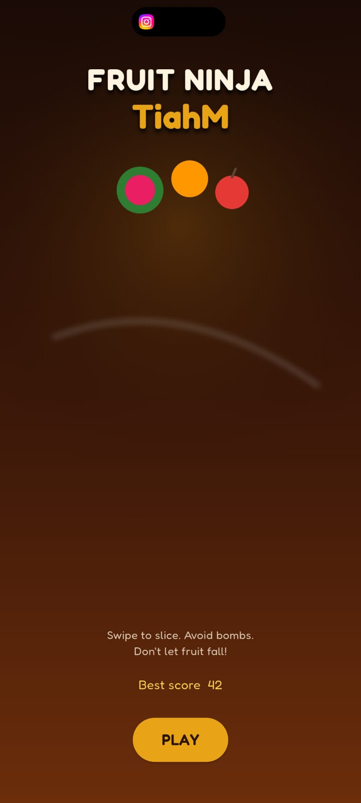
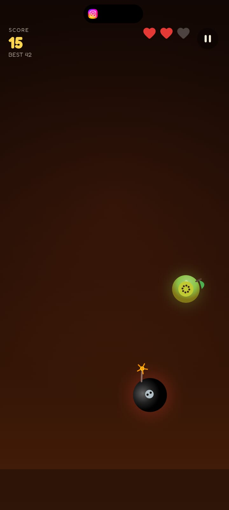
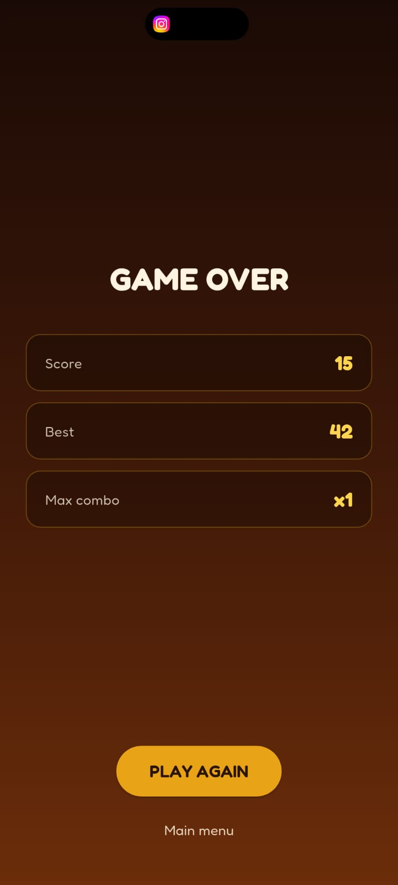

# Fruit Ninja TiahM

A swipe-to-slice Fruit Ninja style mobile game built with **Flutter** and **Dart**.

## Screenshots

### Home


### Gameplay


### Game Over


## Features

- Slice flying fruit with a glowing blade trail
- Bombs end the round if sliced
- Three lives — missed fruit costs a life
- Combo scoring for quick consecutive slices
- Rising difficulty over time
- High score saved locally
- Pause / resume and game-over flow

## Run

```bash
flutter pub get
flutter run
```

## Project layout

```
lib/
  main.dart
  theme/
  screens/     # Home, Game, Game Over
  widgets/     # HUD
  game/
    models/
    engine/    # Physics, spawn, slice detection
    painters/  # Custom-painted fruit, bombs, effects
```
